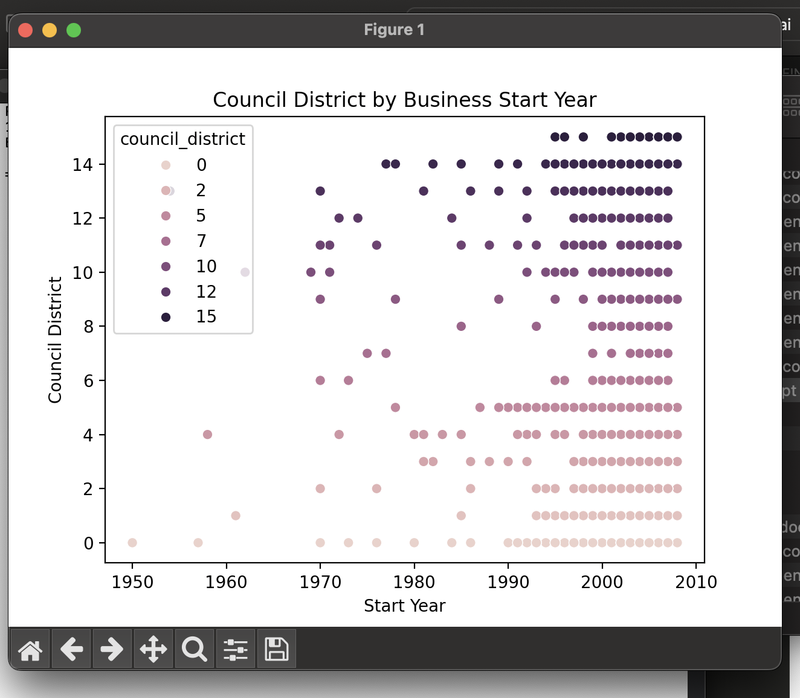
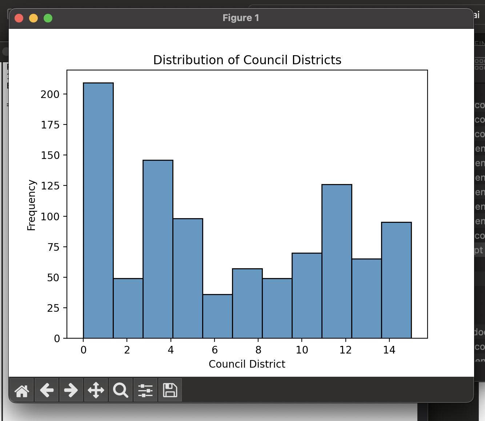

# LA City Business Data Visualization

## Overview
Python-based analysis of Los Angeles city business data, exploring business registrations and openings across council districts using data visualization techniques.

## Project Description
Developed comprehensive visualizations analyzing LA city business data from a JSON dataset. Created multiple chart types to identify patterns in business distribution and growth across different council districts.

## Visualizations

### Scatter Plot: Business Openings by Council District Over Time

This scatter plot visualizes when businesses opened across different Los Angeles council districts, with each district represented by a unique color. The visualization reveals temporal patterns in business establishment and identifies economic development trends across the city.

**Key Insights:**
- Color-coded visualization enables quick identification of district-specific patterns
- Time-series analysis reveals business growth trends across different years
- Distribution shows concentration of business activity in specific council districts

---

### Histogram: Business Registration Frequency by Council District

This histogram displays the total number of registered businesses within each Los Angeles council district. The frequency distribution provides a clear comparison of business concentration across districts.

**Key Insights:**
- Clear visual comparison of business density across all council districts
- Identifies districts with highest and lowest business registration rates
- Provides data-driven insights for economic development planning

## Technologies Used
- **Python** - Data processing and analysis
- **Seaborn** - Statistical data visualization
- **Pandas** - Data manipulation
- **Matplotlib** - Plotting framework
- **JSON** - Data format

## Methodology
1. Imported LA city business data from JSON format
2. Cleaned and structured dataset using Pandas
3. Performed exploratory analysis on council districts and business patterns
4. Created visualizations using Seaborn to reveal insights

## Key Findings
- Analyzed business registration patterns across LA council districts
- Identified temporal trends in business openings
- Compared business density across different districts

## Author
**Khalia Anderson**  
Information Systems & Analytics Student
